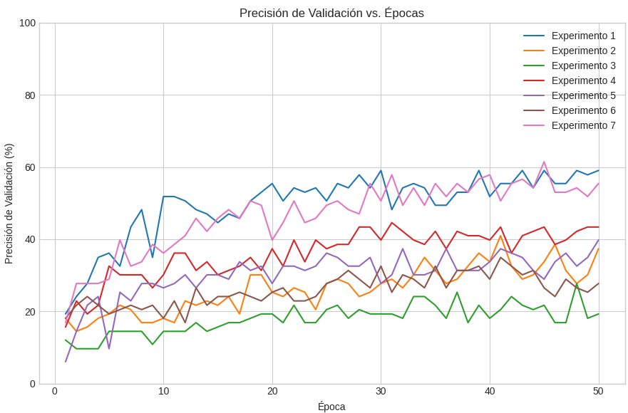

# 🦋 Proyecto de Clasificación de Mariposas con Perceptrón Multicapa (MLP) en PyTorch

Este proyecto tiene como objetivo explorar el rendimiento de un **Perceptrón Multicapa (MLP)**, implementado en **PyTorch**, para la clasificación de imágenes de mariposas.  
A través de una serie de experimentos, se evalúa cómo diferentes configuraciones y parámetros afectan la **precisión** y la **pérdida** del modelo.

---

## 📁 Estructura del Proyecto

El repositorio está organizado de la siguiente manera:
- `docs/`: Carpeta con archivos **CSV de métricas de cada experimento**, usados en la gráfica comparativa
- `imagenes/`: Carpeta con **ejemplos de mariposas** y **gráficas exportadas** para el README    
- `EXP01_...`: Notebook de Jupyter del **Experimento 1**  
- `EXP02_...`: Notebook de Jupyter del **Experimento 2**  
- `EXP03_...`: Notebook de Jupyter del **Experimento 3**  
- `EXP04_...`: Notebook de Jupyter del **Experimento 4**  
- `EXP05_...`: Notebook de Jupyter del **Experimento 5**  
- `EXP06_...`: Notebook de Jupyter del **Experimento 6**  
- `EXP07_...`: Notebook de Jupyter del **Experimento 7**  
- `Grafica Comparativa EXP1_7.ipynb`: Notebook para la **visualización y comparación de los resultados**  
- `README.md`: Este archivo  

---

## 🔍 Metodología

En cada experimento se siguió la siguiente metodología:

1. **Carga y Preprocesamiento del Dataset**  
   - Imágenes cargadas desde el dataset de mariposas.  
   - Redimensionamiento y normalización.  
   - Conversión a vectores para ser utilizadas como entrada en el MLP.  

2. **Configuración del Modelo**  
   - Ajuste de hiperparámetros:  
     - Tasa de *dropout*  
     - Resolución de imágenes  
     - Número de épocas  
     - Arquitectura (capas y neuronas)  
     - Tasa de aprendizaje  

3. **Entrenamiento y Evaluación**  
   - Entrenamiento del MLP con retropropagación.  
   - Evaluación en términos de **pérdida y precisión**.  

---

## 📊 Comparativa de Experimentos

El notebook [`Grafica Comparativa EXP1_7.ipynb`](./Grafica%20Comparativa%20EXP1_7.ipynb) consolida los resultados de los siete experimentos en tablas y gráficos.

### Resumen de Configuraciones y Resultados

| Experimento | Data Augmentation | Dropout | Resolución | Arquitectura | Learning Rate | Épocas |
|-------------|------------------|---------|------------|--------------|---------------|--------|
| **EXP01**   | No               | 0.0     | 64x64      | 128x64 Neuronas | 0.001 | 50 |
| **EXP02**   | No               | 0.5     | 64x64      | 128x64 Neuronas | 0.001 | 50 |
| **EXP03**   | Sí               | 0.5     | 64x64      | 128x64 Neuronas | 0.001 | 50 |
| **EXP04**   | Sí               | 0.3     | 64x64      | 128x64 Neuronas | 0.001 | 50 |
| **EXP05**   | Sí               | 0.3     | 64x64      | 64x32 Neuronas  | 0.001 | 50 |
| **EXP06**   | Sí               | 0.3     | 128x128    | 128x64 Neuronas | 0.001 | 50 |
| **EXP07**   | Sí               | 0.0     | 64x64      | 128x64 Neuronas | 0.0005 | 100 |

---

## 📈 Ejemplo de Resultados

La siguiente figura muestra un ejemplo de la **precisión de validación vs. número de épocas**, incluida en el notebook comparativo:  


---

## 🚀 Cómo Usar este Proyecto

1. Clonar el repositorio:  
   ```bash
   git clone https://github.com/UTEC-IA-2025/-Proyecto_3_Clasificaci-n_Mariposas/tree/main
   cd -Proyecto_3_Clasificaci-n_Mariposas
